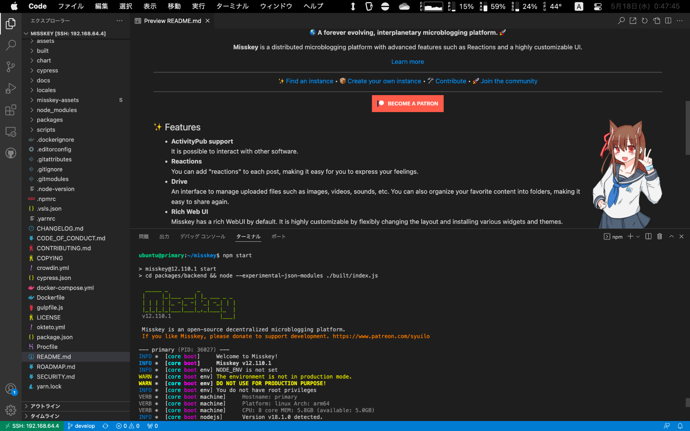
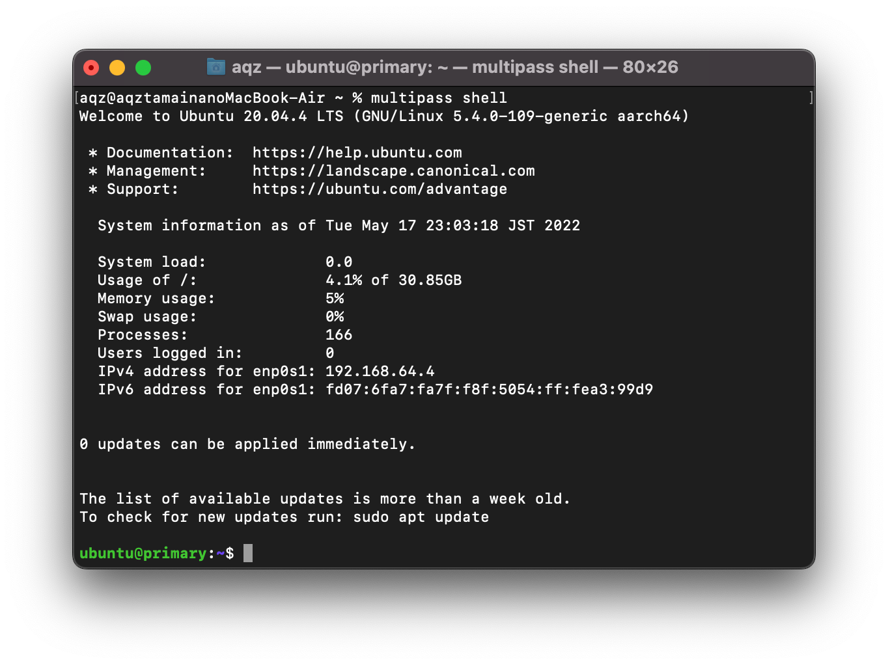
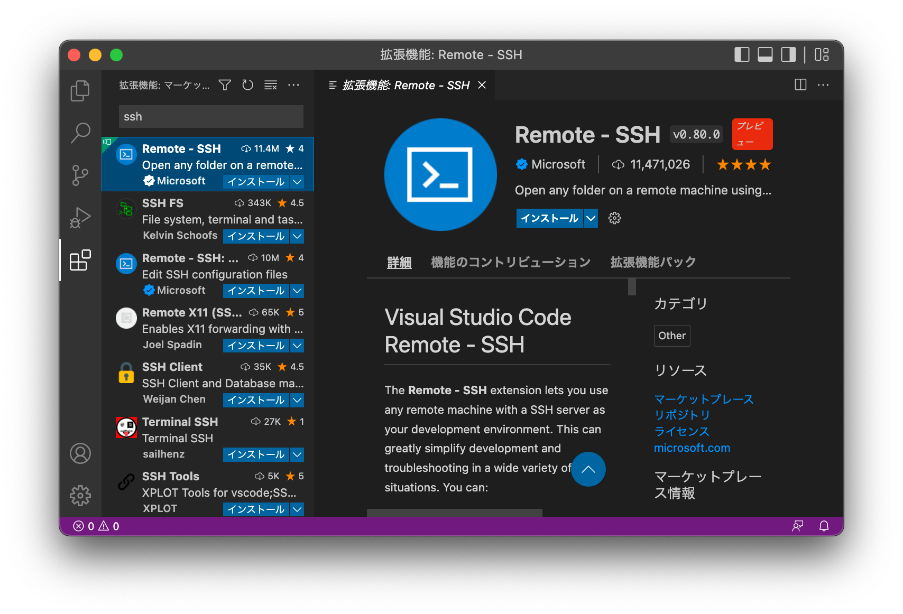
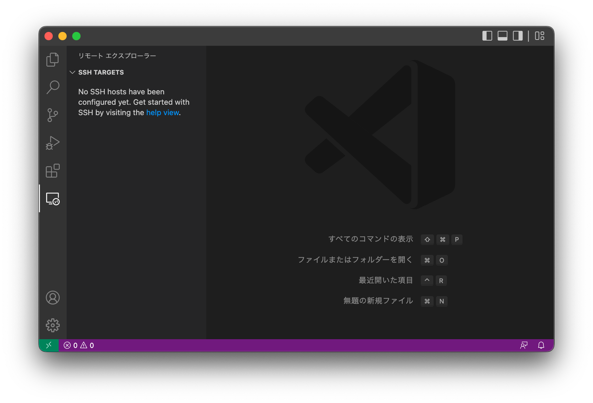
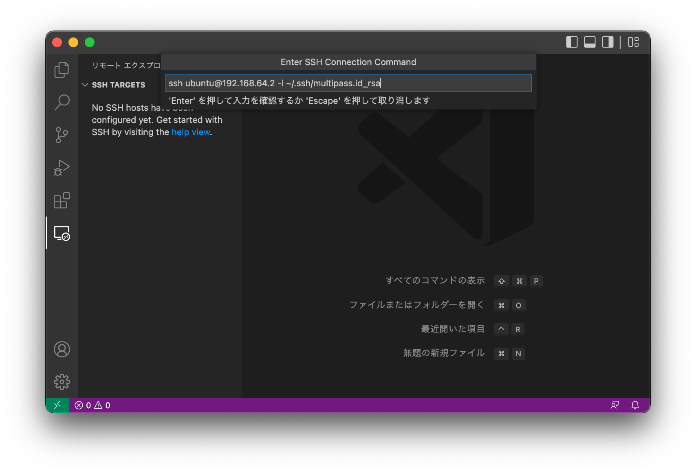
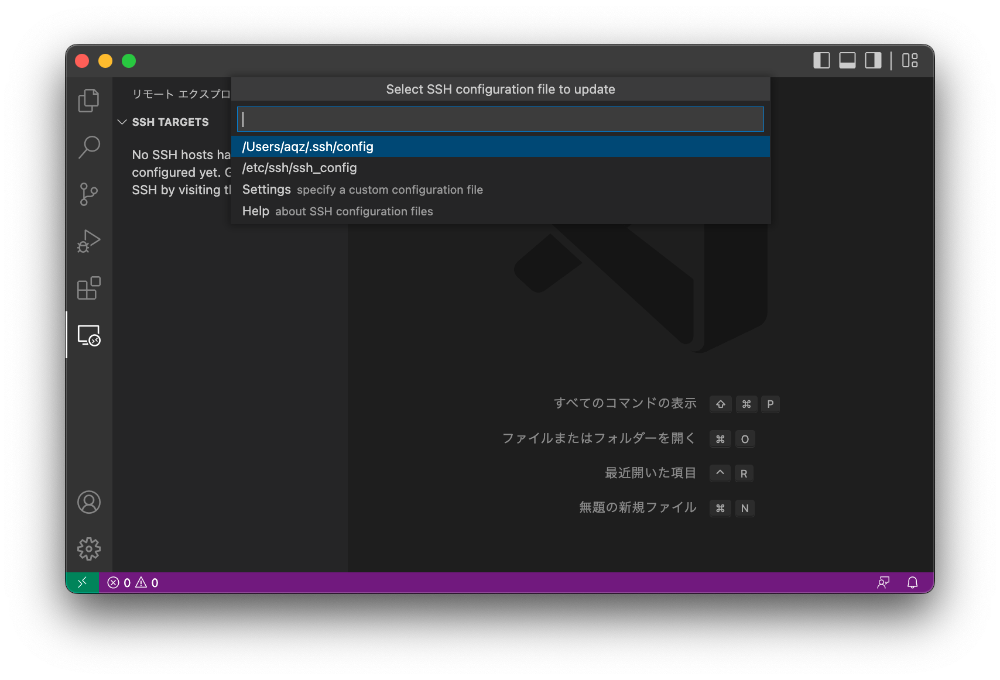
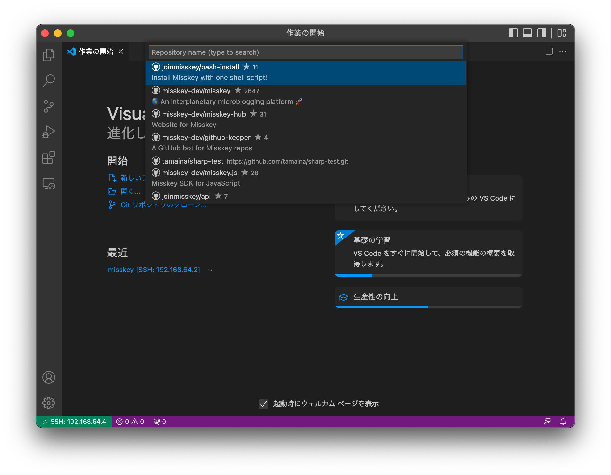
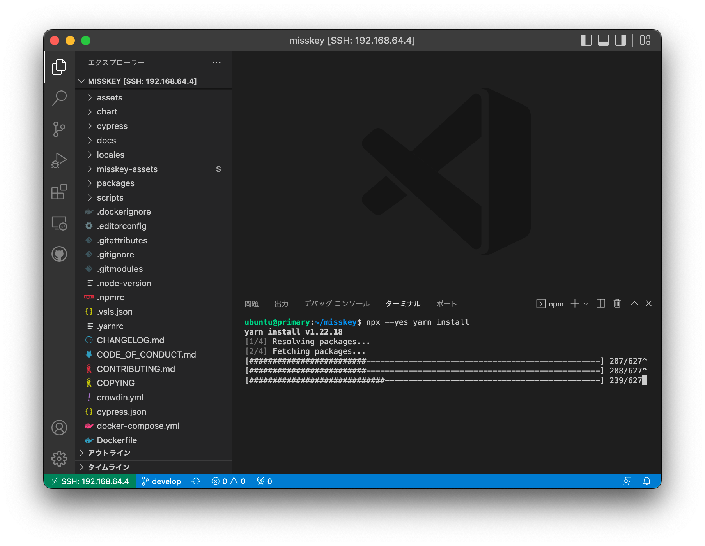

# Multipassを使ってmacOSでMisskey開発はやめておこう
Multipassは私の環境ではどうも不安定になってしまったため、お勧めできません！

## Multipassは不安定なのでやめました
「Multipassを使ってmacOSでMisskey開発をはじめよう」という題名で記事を書いていましたが、**Multipassは私の環境ではどうも不安定になってしまったため、お勧めできません！**

[UTM](https://mac.getutm.app/)を使う方が安定しているかと思います。

## それでもMultipassを使いたい方は以下をお読みください
macOSにはHomebrewもありますが、いろいろ面倒なのでLinuxを使うのが好ましいと思っています。\
簡単にUbuntuバーチャルマシンを実行できる「Multipass」でMisskey開発を行います。\
MultipassやMisskeyはApple Silicon (ARM64)でも動作します。

Visual Studio Codeを使用する前提で説明します。

[Windowsの場合はWSL2を使うことをお勧めしています。](https://hide.ac/articles/t6Gdoxdfh)

## Multipassのインストールとダウンロード

次のリンクからmacOS版Multipassをダウンロードし、インストールを行ってください。\
<https://multipass.run/download/macos>

## Multipassインスタンスの作成・実行

CPUスレッド数(cpus)、ディスクサイズ(disk)、メモリ上限(mem)を指定してprimaryインスタンスを作成します。\
本体のメモリが8GBの場合はmemをもう少し小さくしたほうがいいかもしれません。

    multipass launch -n primary --cpus 8 --disk 32G --mem 6G

しばらくすると、見慣れたシェルが出てきます。

後で使用するので、IPアドレス(IPv4 address for enp0s1)は控えておいてください。\
スクリーンショットは以前にインスタンスを作成したことがあるため`192.168.64.4`となっていますが、通常は`192.168.64.2`になると思いますので、説明文は`192.168.64.2`とします。

まずはパッケージのアップデート・アップグレードをします。

    sudo apt update
    sudo apt upgrade -y

インスタンスを再起動します。

    exit
    multipass restart

`multipass shell`でインスタンスのシェルを開きます。

    multipass shell

## 各種パッケージのインストール

    # build-essential
    sudo apt install build-essential -y

    # Node.js

    curl -sL https://deb.nodesource.com/setup_current.x | sudo -E bash -
    sudo apt install -y nodejs
    node -v

    # PostgreSQL

    wget https://salsa.debian.org/postgresql/postgresql-common/raw/master/pgdg/apt.postgresql.org.sh
    sudo sh apt.postgresql.org.sh -i -v 13
    sudo systemctl restart postgresql

    # Redis

    curl -fsSL https://packages.redis.io/gpg | sudo gpg --dearmor -o /usr/share/keyrings/redis-archive-keyring.gpg
    echo "deb \[signed-by=/usr/share/keyrings/redis-archive-keyring.gpg] https://packages.redis.io/deb $(lsb_release -cs) main" | sudo tee /etc/apt/sources.list.d/redis.list
    sudo apt update
    sudo apt install redis -y
    sudo systemctl restart redis-server

## PostgreSQLのセットアップ

psqlの操作をします。

    sudo -u postgres psql

ユーザー（misskey）を作成し、パスワード（hoge）も設定します。パスワードは適当でいいと思います。\
Misskey用データベース（mk1としています）の作成をして、psqlから抜けます。

    CREATE ROLE misskey LOGIN CREATEDB PASSWORD 'hoge';
    CREATE DATABASE mk1 OWNER misskey;
    exit

## SSH接続の準備

SSH接続には準備が必要です。\
macOSのシェル(zshなど)を開き、次のコマンドを実行します。

    sudo cp /var/root/Library/Application\ Support/multipassd/ssh-keys/id_rsa ~/.ssh/multipass.id_rsa
    sudo chown `id -un` ~/.ssh/multipass.id_rsa

VS Codeを開き、拡張機能「Remote - SSH」をインストールします。

「リモートエクスプローラー」のタブが追加されるので、開きます。\
（既にリモート拡張機能を使用していた場合は、「SSH Targets」を選択します。）

「SSH TARGETS」の横の＋アイコンを選択します。

ダイアログが出てくるので、`ssh ubuntu@192.168.64.2 -i ~/.ssh/multipass.id_rsa` と入力します。\
（`192.168.64.2`が自分のインスタンスのIPを指すようにしてください。`multipass list`で確認可能です。）

`/Users/(ユーザー名)/.ssh/config`を選択します。

## MultipassインスタンスにVS CodeでSSH接続する

192.168.64.2が追加されたので、その右側の「ウィンドウに+が付いたアイコン」を選択します。

新しいウィンドウが開きます。\
初回の起動はセットアップが必要なためしばらく時間がかかります。\
リモートに接続している間は、左下に接続先が表示されます。

Misskeyのリポジトリをgit cloneします。\
例えば、開始 / Gitリポジトリのクローン - Clone from GitHubからmisskey-dev/misskeyを選択します。ディレクトリ選択ダイアログはそのままEnterで良いでしょう。ダウンロードが終わったら右下のOpenを選択するとクローンしたディレクトリを開けます。

control + shift + ^ でターミナルを開きます。

submodule updateを実行してください。

    git submodule update --init --recursive

## 続き

[続きはWSL2版の記事を参考にしながらやっていってください。](https://hide.ac/articles/t6Gdoxdfh#title-18)

ただし、default.ymlでは、urlの`localhost`をMultipassインスタンスのIPアドレスに置き換えてください。

    # 　 アクセスするURL
    url: http://192.168.64.2:3000

## いかがでしたか？

LinuxはRaspberry PiなどがあったためARM64に早くから対応しており、何不自由なく作業できます。ぜひLinuxを使って開発してください。
