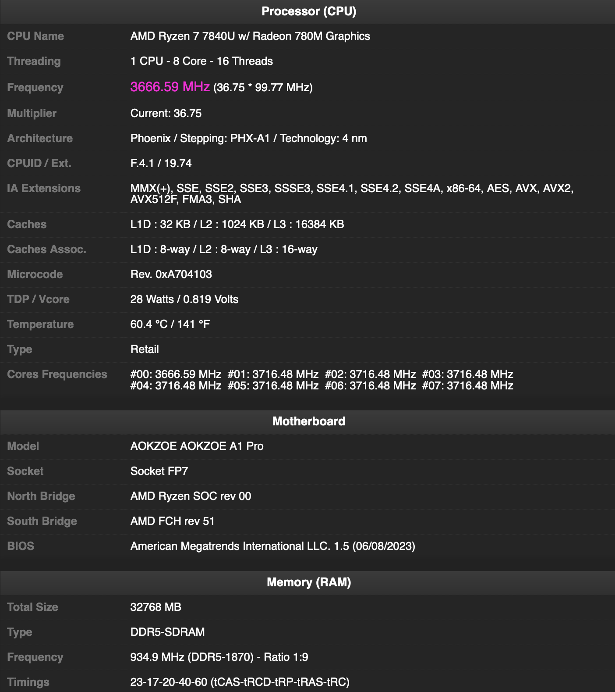
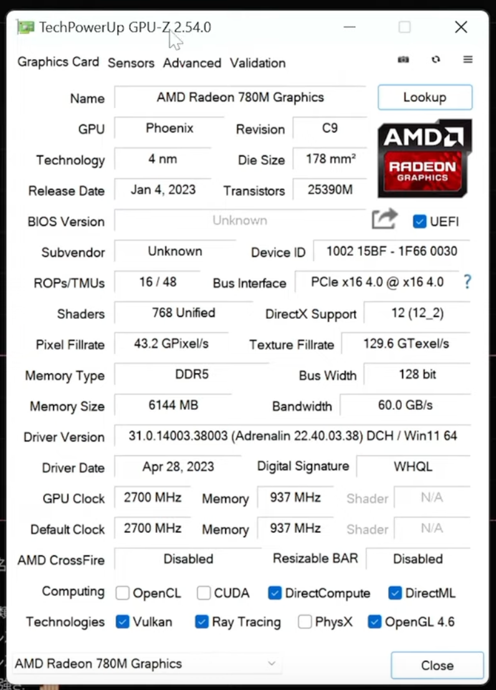
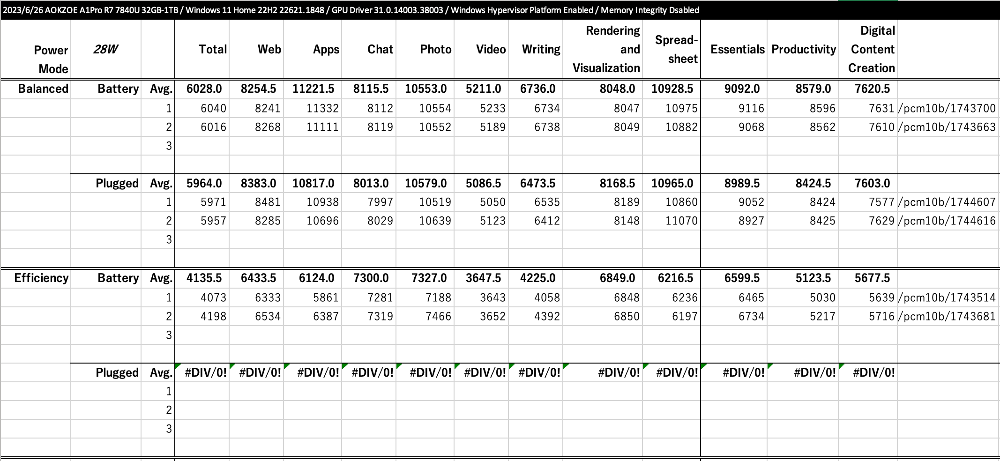
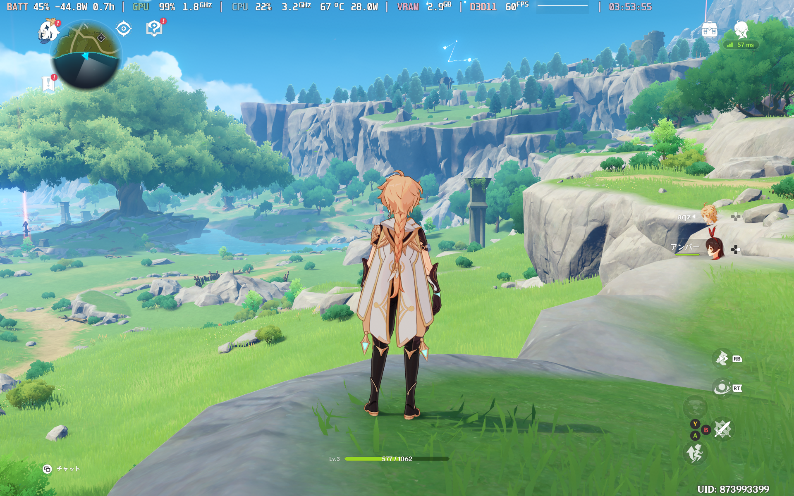
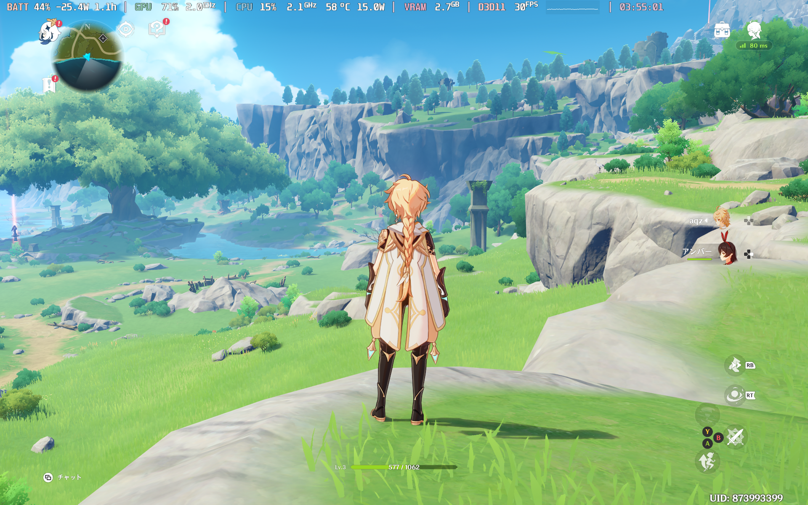

# AOKZOE A1Proレビュー #2.1 ベンチマークとゲーム動かしてみた編（情報は古い）
6/26時点での、CPU-Zなどのハードウェアの情報や、今までのベンチマークやゲーム動作の感想を掲載します。

[**#0 座学と購入編**](../06-20%20aokzoe-a1pro-0)  
[**#1 開封・外観・操作編**](../06-23%20aokzoe-a1pro-1)

## この記事で言いたいこと
先に結論を書きます。

多くの重たいゲームでは以下の設定でプレイしたほうが良さそうです。

- CPUブーストはオフ
  Game Center Panel → LスティックでCPU最大ステータス選択 → Y選択 でCPUブーストの切り替えができます。
- TDPはお好きにどうぞ  
  CPU性能はブーストオフでは変わらないので、TDP設定=グラフィック出力設定と言える
- 外に行った時は15W・30fps制限、FSR/RSRを活用しよう  
  （ありきたりな結論？GPU計算量を抑える手段は限られるので…）
- バッテリー駆動ではWindows設定の電源モードがバランスかどうか確認（効率モードは流石に厳しい）

（軽いゲームとかインディーゲームを遊ぶなら本体は圧倒的にSwitchの方が安いぞ！）

## ちょっと悪い話
ベンチマーク・動作検証の前に、前の記事の公開から数日経って判明したAOKZOEの悪い話を2つ書きます。

### 画面が焼き付く
AOKZOE A1Proの液晶は**焼きつきます**。  
有機ELではないのでスリープや再起動などで画面をオフ＆オンすると治りますが、スクリーンセーバーを有効化しておくべきです。

### ハイビーム/天空の企業体質も微妙らしい
A1をハイビームで購入し、1年以内にバッテリーが膨らんでしまった方の報告によると、「購入後の1年間保証（国内修理）も付帯」と記載していたにもかかわらず、ハイビーム曰くバッテリーだけは3ヶ月保証であり、3ヶ月を超えると有償修理になると言われたとのことです。  
www.aokzoe.jpやHIGH-BEAMオンラインショップを見る限り、3ヶ月という数字はどこにも見つけられませんでした。後出しで3ヶ月と言われたことになりますね。  
仮に書いてあったとしても、本体は1年でもバッテリーだけ3ヶ月というのはケチですし、バッテリーがそのくらいしか持たない製品は買うべきではありませんね。

なお、aokzoestore.comは修理部品としてバッテリーも販売していますが、日本への発送には非対応です。よって自力修理もできません。

## 免責
この記事のベンチマーク・動作結果は、筆者一個人が趣味で計測したものです。

この記事を利用もしくは参考にした際に生じた金銭、物品、生命等の損失、損害等の責任について、筆者は賠償等の請求に一切応じません。

### ドライバについて
記事執筆現在、AMDからは7840Uのドライバは公式にリリースされていません。公式リリース後の性能は異なる可能性があります。

UMPCの活用方法として、Radeon Super Resolution(RSR)を利用しバッテリー持続時間を向上する手法が用いられますが、筆者は現在RSRを有効化することができておりません。

### Windowsの機能やバックグラウンドタスクについて
Windows ハイパーバイザープラットフォームは有効、メモリ整合性は無効にして計測しています。両者を無効にするとゲームパフォーマンスが向上すると言われていますが、前者はGoogle Play GamesやWSLのため有効にする機会が多いと判断し、有効にして計測しています。

ベンチマーク結果にはSteamなどのバックグラウンドタスクが影響したりしていなかったりする可能性があります。

## HW,バージョン等
- Windows 11 Home 22H2 22621.1848
- Ryzen 7 7840U
- LPDDR5X-7500 32GB
- Radeon 780M 6144MB (Driver 31.0.14003.38003 / Addrenaln 22.40.03.38)
- PCIe 4.0 NVMe SSD 1TB

## ベンチマーク結果リンク
Excelのスクリーンショットの元データは[OneDriveでExcelファイルを公開](https://1drv.ms/x/s!AslpdQzTI0zLjtVgqI5eD1aYrHwoHA)しています。

なるべく2回計測して安定した結果が出るようにしています。

## 1. CPU-Z/GPU-Z

[CPU-Z Validation: valid.x86.fr/yf0ly1](https://valid.x86.fr/yf0ly1)

## 2. Geekbench 6 CPU
Geekbench 6のCPUスコアを、TDP（28W/15W）、電源モード（Efficiency:効率/Balanced:バランス/Performance:パフォーマンス）、電源接続の有無でそれぞれ計測してみました。

電源モードをパフォーマンスにすると、突然電源が切れてしまいました。ベンチマーク結果もなぜかバランスより悪かったため、これ以降パフォーマンスは使わないこととします。

Geekbench 6 CPUベンチで優秀だったのは28W・電源接続・バランスでした。シングルスコアが素晴らしい。

## 3. CPU-Z Bench, Cinebench R23
CPU-ZベンチとCinebench R23でもCPU性能を計測しました。

※7/5訂正: バランス・バッテリー時のシングルコアブーストが間違っていたのを修正（電源接続時の5.1GHzではなく、4GHzまでしか出ない）。

Multi Freq.はマルチコア性能計測時の全コアの平均的な周波数、Single Freq.はシングルコア性能計測時の最大周波数を示しています。

5.1GHz（5115.8MHz）を出すために、1.425VというデスクトップPC並みの電圧を要求します。  
確かにシングル性能は上がり、ゲームの性能も上がるかもしれません。しかしCPUがここまでブーストするとCPUに電力を使いすぎてGPUの性能が発揮できなくなります（28Wの枠の話ではあります）。  
また、電圧を上げると発熱が大きくなり、ファン音も増大します。CPUブースト無効化は騒音対策への有効な解決策です。

というわけで、CPUを多く使わないゲームでは、CPUブーストをやめて（3.3GHz定格運用にして）GPUの方に電力を回しましょう！

## 4. 3DMark
3DMarkでも同じような条件で計測しました。多少傾向はあるものの、大きな差は全くありません。CPUブーストを無効にしても問題なさそうです。  
多くの人が想像するのと違うおかしな結果（バッテリーのほうが電源接続より良いもの）は再計測しています。

計測のリンクを掲載しているものの、ULのデータベースにないプロセッサであるためか公開できませんでした。

## 5. PCMark10
PCMark10の結果です。他のシステムと比較しないため考察もクソもありませんが参考までに。  
最高7620。

## 6. CrystalDiskInfo, CrystalDiskMark
AOKZOE独自で実装しているNVMe SSD(PCIe 4.0)の、CrystalDiskInfoおよびCrystalDiskMarkの結果です。  
7000MB/sはそこら辺のデスクトップPCでは出せません。Born for AAA Gamesは伊達じゃない。

## 7. ゲームベンチマーク
ゲームのベンチマークも色々回したかったのですが、ちょっと時間がなくて4タイトルしかやっていません。  
（実際問題として私はあんまりゲームを持っていないため皆様の期待したタイトルが出てこないと思いますが…）

### BLUE PROTOCOL, FF14/15

やや快適とかとは言っても、最低フレームレートの落ち込みはちょっと厳しいかもしれません（12fpsとかになる）。

FF14ベンチマークが全く振いません。これは他のCPUと比べても明らかに異常な値ですが、原因を掴むまでのモチベーションがないことをお許しください……

### STREET FIGHTER 6 Benchmark

VSync OffにするとLOW設定で遊べます。  
（対戦画面が60fps必須なら、そこだけ画質を落とすオプションってないんでしょうかね？）

## 8. ゲームを動かしたぞ
ゲームを動かした感想を文章で伝えます。

### [JR東日本トレインシミュレーター](https://store.steampowered.com/app/2111630/JR/) v1.0.1.152
JR東日本トレインシミュレーターは私が一番興味のあったゲームですが、**7840Uできちんと動きました！**  
このシミュレーターは60fpsでないと正確にシミュレーションが動かないものの、かなりGPUとVRAMを消費します。ですが、Intel+NVIDIA構成である必要はありません。モバイル向けRyzen 7/9だけで動くのです。

京浜東北線は10Wが下限でした。10Wであれば結構長い時間動きます。絶対に人間のほうが先にへばります。

（ちなみにこのバージョンでは、Windowsのスケーリング解像度（ディスプレイの拡大/縮小）を100%より大きくしていると、それに引っ張られて画質が落ちてしまいます。100%に設定して戻せば良いのですが、面倒です。）

### 原神 （Genshin Impact）
原神はみなさん興味があるのではないでしょうか。

FHD+/画質中設定の時、30fpsが15W・60fpsが28Wといったところです。

スクリーンショットを載せます。上のRTSSによると、CPUが28Wの時のデバイスの電力消費量は45W、15Wでは25Wとのこと。  
65Whですので、15Wで2時間持つかなという計算になります。

（FSR/RSRを使って60fps・15Wで遊びたい気がします。FSR2をアンチエイリアスに使っているのにアップスケールに使えないのはなぜ？）

### GTA V
GTA Vは煮詰められていないのでスクショだけ貼って逃げます（RSRを使う必要がありそう）。

### APEX Legends
APEX Legendsは、ROG Allyとかの配信で散々擦られていますが、中くらいの設定にすれば60Hzで動きます。でもこれは28Wなんですよね。割と重い。  
やはり結構解像度を落とす必要があります。

……なんかUIの解像度低い？とりあえずスクショは載せないでおきます……

### Minecraft Bedrock (for Windows)
当然ながらとても快適にプレイできます。

ただ、レイトレーシングを有効にすると解像度を落としても30fps出ません。

### Minecraft Java
wip

## 9. で
FSR3と正式ドライバいつ？

## 10. Geekbench 6 Compute
全く話に絡まなかったGeekbench 6 Computeは最後に紹介します。

