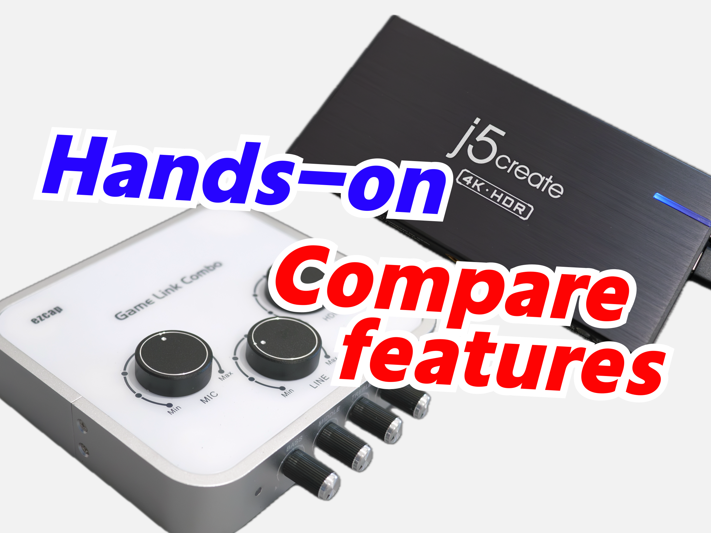

# HDMIキャプチャ j5create JVA14 / ezcap Game Link Combo 仕様検証と比較
1080p120/2160p30に対応した2製品のHDMIキャプチャの動作を確認し、比較してみます。

外装写真などは次のリンクをご覧ください。

[j5create JVA14 開封と外装写真記事](../05-02-1%20j5create-jva14)  
[ezcap Game Link Combo 開封と外装記事](../05-02-2%20ezcap-capture)

## 価格・購入先
### j5create JVA14
[j5create JVA14の公式ページ](https://jp.j5create.com/products/jva14)ではAmazonおよび楽天とPayPayモールのj5create公式ストアへのリンクがありますが、在庫はありませんでした。

[楽天ブックス](https://books.rakuten.co.jp/rb/17349788/)には在庫があったため、こちらで購入しました。19,481円でした。

### ezcap332 Game Link Combo （上海問屋 DN-916264）
ezcap332 Game Link Comboは、上海問屋扱いのHDMIキャプチャです。ドスパラ公式通販にて購入できます。  
ドスパラではezcap製であることは一切言及されておらず、「上海問屋 UVC準拠USB接続・ライブオーディオコンソール一体型HDMIキャプチャユニット DN-916264」として販売されています。私が購入した際は3,980円でしたが、元々は[9,980円で販売していた](https://twitter.com/dospara_web/status/1697563349092057470)ようです。

[ドスパラ公式通販 商品ページ](https://www.dospara.co.jp/SBR439/IC491377.html) / [ezcap 商品ページ](https://www.ezcap.com/Products_details/80.html)

## ユニークな機能
### JVA14
- 天面および底面中央にUNC 1/4-20ネジ穴がついており、カメラシステムの一部として組み込むことができます。
- PD 60W入力ポートがあり、ホスト機器（USB-C接続）に充電しながらキャプチャできます。
  電源が接続されていれば、ホストへの接続がなくとも常にHDMIパススルーが動作します。

### ezcap332
- 天面のノブでHDMI音声・ライン入力・マイク入力の音量をそれぞれ調整可能です。
- 正面のノブでマイク音声の調整ができます（3バンドイコライザ・エコー）

## HDMIキャプチャの仕様

### 基本的な仕様
| | JVA14 | ezcap332 |
|--:|:--|:--|
|録画 最大解像度・fps| 2160p30 / 1440p60 / 1080p120 | 2160p30 / 1440p60 / 1080p120 |
|パススルー 解像度・fps| 2160p30 / 1440p60 / 1080p120 | HDR2160p60 / HDR1440p144 / HDR1080p240 |
|HDCP解除| 不可 | 不可 |

### JVA14の仕様

仕様表に載っていないものの、なぜかWindowsではP010を選択できます。  

#### Windows OBSで選択可能な映像フォーマットとfps
| | XRGB fps | P010 fps | YUV2 fps | NV12 fps |
|--:|:-:|:-:|:-:|:-:|
|2160p| - | - | - | 30 |
|1440p| - | - | 50, 48, 40, 30 | 60, 59.94, +YUV2 |
|1080p| 30 | Same as YUV2 | 60, 59.94, 50, 48, 40, 30 | 120, 119.88, 100, +YUV2 |
|720p| 60, 59.94, 50, 48, 40, 30 | Same as XRGB | Same as XRGB | Same as XRGB |
|640x480| 60, 59.94, 50, 48, 40, 30 | - | Same as XRGB | Same as XRGB |

#### macOS OBSで選択可能な映像フォーマットとfps
| | YUV2 fps | NV12 fps |
|--:|:-:|:-:|
|2160p| - | 30 |
|1440p| 50, 30 | 60, 30 |
|1080p| 60, 50, 30 | 120, 60, 30 |
|720p| 60, 50, 30 | 120, 60, 30 |
|640x480| 60, 50, 30 | 120, 60, 30 |

色範囲はCS 601, 映像のレンジはリミテッドのみ選択可能なため、色の濃さはおかしくなってしまう

#### 色範囲

XRGB: よくわからない（フルより広いがOBSは非対応）  
P010, YUV2, NV12: フルレンジ

### ezcap332の仕様

#### Windows OBSで選択可能なフォーマットとfps
| | XRGB fps | P010 fps | YUV2 fps | NV12 fps |
|--:|:-:|:-:|:-:|:-:|
|2160p| - | - | - | 30 |
|1440p| - | - | 50, 48, 40, 30 | 60, 59.94, +YUV2 |
|1080p| 30 | - | 60, 59.94, 50, 48, 40, 30 | 120, 119.88, 100, +YUV2 |
|720p| 60, 59.94, 50, 48, 40, 30 | - | Same as XRGB | Same as XRGB |
|640x480| - | - | - | - |

#### macOS OBSで選択可能な映像フォーマットとfps
| | YUV2 fps | NV12 fps |
|--:|:-:|:-:|
|2160p| - | 30 |
|1440p| 50 | 60, 50, 30 |
|1080p| 60, 50, 30 | 120, 60, 50, 30 |
|720p| 60, 50, 30 | 120, 60, 50, 30 |

色範囲はCS 601, 映像のレンジはリミテッドのみ選択可能

#### 色範囲

XRGB, YUV2, NV12: リミテッドレンジ

### 遅延
OBSの画面をOBSでキャプチャしてみました。どちらも変わらず低遅延かと思います。

<embed-youtube video-id="Afk-P9sLUYo"></embed-youtube>

## 音声入出力

| | JVA14 | ezcap332 |
|--:|:--|:--|
|出力形式| 2ch 48KHz/16bit | 2ch 48KHz/16bit |
|マイク入力|プラグインパワー ステレオ|プラグインパワー モノラル|
|ライン入力|なし|あり|
|モニター|あり|あり|

### 音声入力について
JVA14は、ホストに接続されていればマイク入力を出力してくれます。一方で、ezcap332は、HDMI入力がなければ音声入力は出力されません。

### モニター出力について
モニター音声は、どちらもMix後の音声が出力されます。  
JVA14は結構ノイズがある一方、ezcap332は比較的音がいい気がしました。

## 熱について
JVA14は筐体がわりかし温かくなります。一方でezcap332はあまり温かくなりません。長時間の録画が可能かについては検証していません。

## 不可解な現象（バグ？）
### 色範囲について
JVA14のXRGBの色範囲がリミテッドでもフルでもなく、おかしいです。

### 音声信号について
ezcap332では、パススルー時、音声は192KHz/24bitなどHDMIが（おそらく上流のモニタが対応する）対応する音声信号を選択できるが、キャプチャは48KHz/16bitまでしか対応していないため、これ以上の信号形式を選択するとノイズがキャプチャされることになります。  
JVA14は、48KHz/16bitまでしか選択できないようになっています。

### パススルー先のディスプレイが16:9でない場合
16:9でないディスプレイに接続した際は、両者とも16:9まで横幅を縮小してキャプチャするようです。

16:10ディスプレイへパススルー接続した際、JVA14はPCから16:9しか選択できません（ディスプレイでは上下に少し伸びた状態になります）。ezcap332は16:10を選択できました。21:9は両方とも対応していました。

### 単独使用時の内部仮想ディスプレイのフレームレートについて
パススルー先のディスプレイがなければキャプチャに内蔵された仮想ディスプレイに出力する扱いとなるわけですが、JVA14はその場合、120Hzが選べませんでした……と書こうとしたのですが、本当かなと思いもう一度確認したら240Hzまで見えました。  
（使っているケーブルがHDMI 2.0対応でなければ120Hzが見えない可能性はありそうです。）

ezcap332へは安定して120Hzまで出力可能です。

### ezcap332は映像にノイズが乗ることがある？
ezcap332は、特に映像フォーマットが変わった際にキャプチャ映像にノイズが乗りがちです。

## 何が違うの
- **パススルー解像度**: JVA14の方がパススルー性能が高いです。
- **色範囲**: JVA14はフルレンジ、ezcap332はリミテッドレンジです。  
  ただし、macOS OBSではJVA14はむしろフィルタでの調整が必要となります。
- **音声処理**: それぞれに個性があります。
- **筐体**: JVA14はコンパクトかつ1/4ネジ穴があるため取り回しが大変良い一方、ezcap332は大きく重たい上に固定もままならないので邪魔になりがちかと思います。

## どっちがいいの
基本的には安価なezcap332を買えばいいと思います。

## 感想
色範囲（フルレンジ/リミテッドレンジ）は流石にスペック表に書いておいてほしいものです。  
（が、そもそもOBSの初期設定はリミテッドレンジなのでキャプチャはリミテッドレンジでも問題ない気もします。しかしその場合ゲーム側でリミテッドレンジに収まるように明るさの設定を変更しないと暗い場面や明るい場面で配信が見辛いことになると思うのですが……）

あと、HDMIキャプチャにミキサー機能要ります……？（というか軽い配信にはハードウェアミキサー自体……？）  
（とはいえ何らかのタイミングで使う可能性がある気もしますが）
